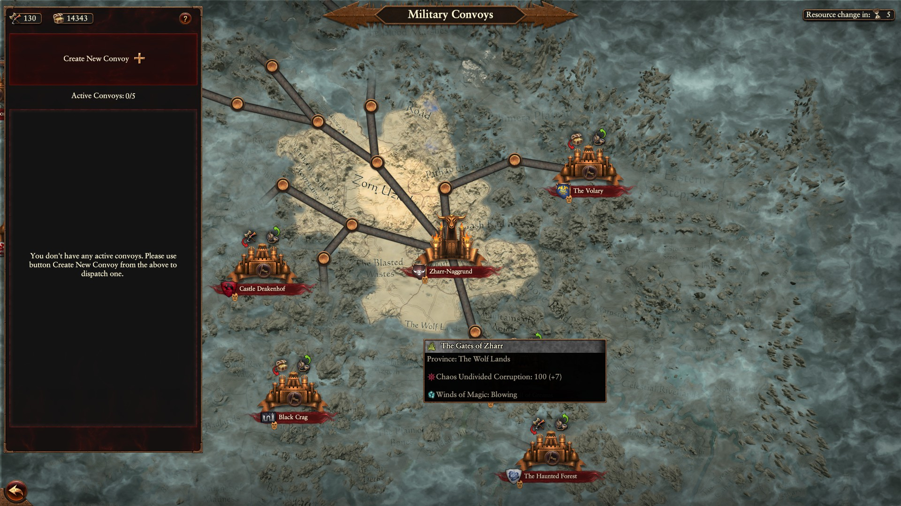

# More Military Convoys

This very simple mod increases the default amount of military convoys available to four. This means Astragoth and Drazhoath should start with five convoys, and Zhatan with six.

##  About Me

I'm a YouTuber/Game Developer/Modder who is interested in all things necromancy and minion-related. Please check out my [YouTube channel](https://www.youtube.com/channel/UCPlZ1XnekiJxKymXbXyvkCg) and if you like the work I do and want to give back, please consider supporting me on [Patreon](https://www.patreon.com/chebgonaz?fan_landing=true) or throwing me a dime on [Ko-fi](https://ko-fi.com/chebgonaz). You can also check out my [website](https://necrobase.chebgonaz.com) where I host information on all known necromancy mods, games, books, videos and also some written reviews/guides.

Thank you and I hope you enjoy the mod! If you have questions or need help please join [Da Modding Den](https://discord.gg/moddingden) and ping me.

## Installation (manual)

- Copy the pack file and icon to `SteamLibrary/steamapps/commo/Total War WARHAMMER III/data` and then enable in the mod manager.

## Special Thanks

A special thanks to the people who've helped me along the way:

- From Da Modding Den discord server:
    + **Rhox** - For holding my hand throughout the learning process.
    + **Drazhir** & **DJ Fro Fro**: For general help/advice on the tools etc.

## Changelog

2024

Date | Version | Notes
--- | --- | ---
14/06/2024 | 0.0.2 | tweaking and get it working
14/06/2024 | 0.0.1 | initial commit

